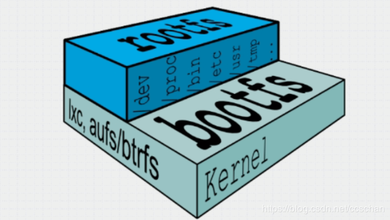
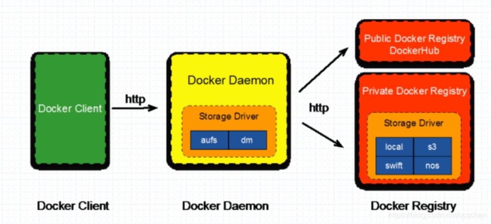

# 镜像，容器和仓库

## 镜像

容器运行时的只读模板，操作系统+软件运行环境+用户程序。

容器镜像是一个不可变的只读文件，其中包含有关创建Docker容器的说明。每次基于容器镜像文件启动容器时，无论在何处部署容器镜像文件，都将获得完全相同的Docker容器。

例如：一个镜像可以完全包含了Ubuntu操作系统环境，可以把它称作一个Ubuntu镜像。镜像也可以安装了Apache应用程序（或其他软件），可以把它称为一个Apache镜像。

镜像是用来创建容器的。Docker提供了简单的方法来建立新的镜像或者升级现有的镜像，你也可以下载别人已经创建好的镜像。

我们可以大致的把镜像比喻成一个java类：
--------------------
    class User{
                 private String name;
                 private int age;
              }
              

## 容器

容器是从镜像创建的应用运行实例，可以将其启动、开始、停止、删除，而这些容器都是相互隔离、互不可见的

可认为docker容器就是独立运行的一个或一组应用，以及它们所运行的必需环境。

我们可以大致理解容器是类实例出的对象：
--------------
     User user = new User()  

## 仓库

Docker仓库（Repository）用来保存镜像,类似与代码仓库，是Docker集中存放镜像文件的场所。

每个服务器上可以有多个仓库。

仓库又分为公有仓库（DockerHub、dockerpool）和私有仓库。

公有的Docker仓库名字是Docker Hub。Docker Hub提供了庞大的镜像集合供使用。这些镜像可以是你自己创建的，或者你也可以在别人的镜像基础上创建。Docker仓库是Docker的 分发 部分。

启动容器时，docker daemon会试图从从本地获取相关镜像；当本地镜像不存在时，其将从Regitry中下载该镜像并保存至本地；pull镜像必须使用https协议，如果要使用http，必须在配置文件中明确指定信任该http站。

